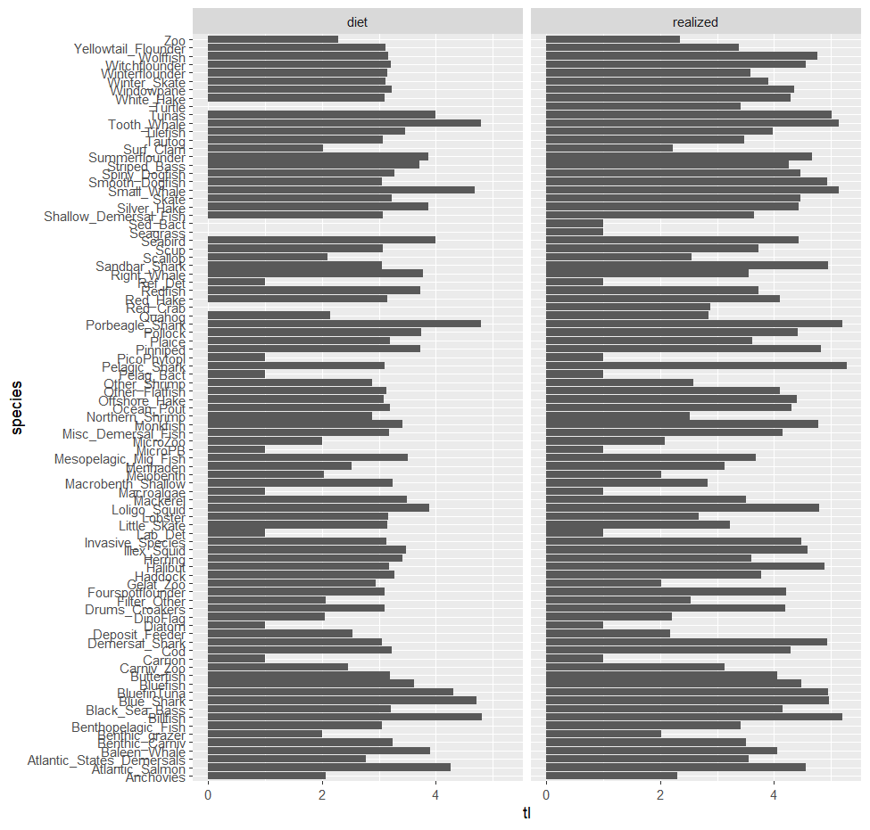

```{r setup, include=FALSE}
knitr::opts_chunk$set(echo = TRUE)
library(magrittr)
library(atlantiseof)
```

## Ecosystem overfishing

$C_i = PP.TE_i^{TL_i-1}$

where $C_i$ = maximum productivity of species *i*, $TE$ = trophic efficiency of species *i*, $TL$ = trophic level of species *i*. PP is assmed to be net primary productivity and is fixed over time and space

The total productivity of a system with *n* species would be

$C = \sum_i^n PP.TE_i^{TL_i-1}$

$TE$ is often assumed to be 10% -16%

$TL$ for a system is often assumed to be 3-4 (a global average of ~3.4)

We are not interested in global estimates. We are interested in regional specific estimates.

A scalar, $\alpha$, is often included to represent the proportion of C that is available to harvest. Studies point to using a value of about 0.15-.2

$C = \alpha \sum_i^n PP.TE_i^{TL_i-1}$

So $C$ represents the total catch in the system

### Ryther index

Using (see [Link and Watson](https://www.science.org/doi/10.1126/sciadv.aav0474) for more info)

$PP = 45Gt C year{-1}$,

$TE =12%$,

$\alpha = .15$,

$TL = 3.4$

yields a value of $C = .42 Gt year^{-1}$. (Total removals from the ocean)

Ryther index ($t km^{-2} year^{-1}$) - total removal per unit area. On a global scale, the total surface area of the ocean  ~ 361 million $km^{-2}$

Upper bound of Ryther threshold is calculated as:

Ryther = $\frac{.42 Gt year^{-1} 10^9}{361 km^{-2}10^6} = 1.14 t km^{-2}year^{-1}$

This would represent the current state of fishing worldwide and considered an acceptable upper bound (based on values of PP, TE, TL, $\alpha$). Other thresholds calculated based on varying these values. We can calculate an envelope by using a range of TL, TE, PP, $\alpha$ values.

### MAB Ryther index. Global thresholds

From Ecodata 2022.
Thresholds based on global estimates of primary production.
```{r ecodataRytherGlobal, eval = TRUE, echo = FALSE}
ecodata::ppr %>%
  dplyr::filter(Var == "Ryther",EPU == "MAB") %>%
  ggplot2::ggplot(.) +
  ggplot2::geom_line(ggplot2::aes(x=Time,y=Value)) +
  ggplot2::geom_hline(yintercept=1.14,color="green") +
  ggplot2::geom_hline(yintercept=.27,color="green") +
  ggplot2::geom_hline(yintercept=2.73,color="orange") +
  ggplot2::geom_hline(yintercept=3.64,color="red") 


```

* Threshold = .276 (PP = 400, alpha = 0.1, TE = .1, TL = 3.6)
* Threshold = 1.14 (PP = 450, alpha = 0.15, TE = .12, TL = 3.4)
* Threshold = 2.73 (PP = 500, alpha = 0.15, TE = .14, TL = 3.2)
* Threshold = 3.64 (PP = 500, alpha = 0.20, TE = .14, TL = 3.2)


### MAB Ryther index. Regional thresholds

From Ecodata 2022.
Thresholds based on regional estimates of primary production.
```{r ecodataRytherMAB, eval = TRUE, echo = FALSE}
ecodata::ppr %>%
  dplyr::filter(Var == "Ryther",EPU == "MAB") %>%
  ggplot2::ggplot(.) +
  ggplot2::geom_line(ggplot2::aes(x=Time,y=Value)) +
  ggplot2::geom_hline(yintercept=.65,color="green") +
  ggplot2::geom_hline(yintercept=2.8,color="green") +
  ggplot2::geom_hline(yintercept=6.72,color="orange") +
  ggplot2::geom_hline(yintercept=8.96,color="red") 

```


* Threshold = .68 (PP = 400, alpha = 0.1, TE = .1, TL = 3.6)
* Threshold = 2.8 (PP = 450, alpha = 0.15, TE = .12, TL = 3.4)
* Threshold = 6.72 (PP = 500, alpha = 0.15, TE = .14, TL = 3.2)
* Threshold = 8.96 (PP = 500, alpha = 0.20, TE = .14, TL = 3.2)


Calculate this on our regional footprint using PP, TL information from region, not relying on Global estimates, since different areas of the world will be more/less productive than others.


## Atlantis information

### Primary producers

We need an estimate of PP $t C year^{-1}$ for NEUS region as our base for estimating system productivity.

Note: Global estimate of PP = 40-50 Gt C $year^{-1}$ (Giga tons= 10^9 tons)

* All primary production (PP) in NEUS atlantis model is forced.
* Data is in annual `currentVersion/tsfiles/Annual_Files/Phyto_Forcing_xxxx.nc` nc files
* nc file contains three phytoplankton functional groups. All are present in the top layer of each box (the euphotic zone, all boxes have an upper 50m layer) and are NA's elsewhere

  * Micro phytoplankton (> 20 $\mu m$) - Split into Atlantis Diatoms and Atlantis Dinoflagellates (Large)
  * Nano phytoplankton (2-20 $\mu m$) (Medium) - Atlantis pico
  * Pico phytoplankton (< 2 $\mu m$) (Small) - Atlantis pico

Currently only large phytoplankton (Diatoms) have a pathway to the upper part of the foodweb in Atlantis. Dont consider Atlantis's dinoflagellates (harmful algal blooms) or pico as part of primary production available

  * diatoms (1 mm)
  * dinoflagellates (.015-.04 mm) 
  * picophytoplankton (0.2-10 $\mu$m) - up to 70% of all productivity
  * Units = $mg N m^{-3}$

Dinoflagellates consumed by filter feeders (deposit feeders, DF, benthic filter feeders, BFF, atlantic states demersal fish, SDF) and bacteria

pico phytoplankton consumed by small zooplankton which are consumed by Meso zooplankton (ZM, Copepods) which are consumed by krill.

Diatoms are consumed by meso zooplankton (ZM), large zooplankton (ZL), planktivores (MAK, HER, MEN)


* Read in nc file using `ncdf4::open.nc()`

* R package `rbgm` to get $mg N m^{-3}$ to $mg N$ in each box (`rbgm::bgmfile(file)`)


Will need to read in, combine and convert to $tons C unitArea^{-1} year^{-1}$
Always more Carbon than Nitrogen in organic matter. C:N of 5.7 used in atlantis.

### Spatial footprint

Atlantis boxes have been mapped to NEUS EPUs (see Caracappa et al)

```{r domain, echo = F}
neusEPU <- plot_footprint_epu()
mabarea <- neusEPU %>% 
  dplyr::filter(epu=="MAB") %>% 
  dplyr::pull(Area) %>%
  sum()/1000000

```

The MAB ~= `r format(mabarea, digits = 2)` $km^2$


All following plots use the NEUS spatial footprint (Boxes 1:22) ~ 264,000 $km^{2}$


```{r N, echo = FALSE}

temp <- base::tempfile()
download.file(url="https://raw.githubusercontent.com/NOAA-EDAB/neus-atlantis/master/currentVersion/neus_tmerc_RM2.bgm",destfile=temp, quiet=TRUE)


pp <- get_pp(bgm = temp,pathToForcing = here::here("data-raw/data"))


  ## plot daily N by EPU and species
  plot_pp(pp,filterbyepu="MAB")

# ggplot2::ggplot(data = pp$dailyspecies %>% dplyr::filter(year >= 1998)) +
#   ggplot2::geom_line(ggplot2::aes(x = t,y=value)) +
#   ggplot2::facet_wrap(ggplot2::vars(variable)) +
#   ggplot2::ylab("N (metric tons)") +
#   ggplot2::ggtitle("Daily Atlantis input data streams")
#   
# #plot_pp(ppdata = pp,filterbyepu=NULL)
# 
overallmean <- pp$daily %>%
  dplyr::filter(year >= 1998) %>%
  dplyr::pull(value) %>%
  mean()
# 
# ggplot2::ggplot(pp$daily %>% dplyr::filter(year >= 1998)) +
#   ggplot2::geom_line(ggplot2::aes(x=t,y=value)) +
#   ggplot2::geom_line(data = pp$annual %>% dplyr::filter(year >= 1998),
#                      ggplot2::aes(x=t,y=value),color="red") +
#   ggplot2::geom_hline(yintercept = overallmean,color="red") +
#   ggplot2::ylab("N (metric tons)") +
#   ggplot2::ggtitle("Total daily PP (combined atlantis input data streams)") 
# 
# ggplot2::ggplot(pp$annual %>% dplyr::filter(year >= 1998)) +
#   ggplot2::geom_line(ggplot2::aes(x=year,y=value)) +
#   ggplot2::ylab("N (metric tons)") +
#   ggplot2::ggtitle("Annual PP (combined atlantis input data streams)") 

```


<!-- Overall mean daily value of PP = `r format(overallmean,digits=2)` $tons N day^{-1}$ -->

<!-- Which translates to `r format(365*5.7*overallmean/1000,digits=2)` $Ktons C year^{-1}$ -->

<!-- Surface area of NEUS = `r format(pp$totalArea,digits=2)` $km^{-2}$ -->

<!-- Scaled up to a global level (multiply by 361 million/`r format(pp$totalArea,digits=2)`)  -->

## MAB threshold

Using three values for system PP. Min, mean, max of annual time series

```{r thresholdsetup, eval = T, echo = F}

mab <- pp$dailyspeciesbox %>%
  dplyr::left_join(.,NEFSCspatial::Neus_atlantis %>% sf::st_as_sf(),by = c("box"="BOX_ID")) %>%
  dplyr::group_by(year,epu,variable) %>%
  dplyr::summarise(N = sum(value),.groups="drop") %>%
  dplyr::mutate(C = 5.7*N) %>%
  dplyr::filter(epu == "MAB",
                variable == "Diatom_N",
                year >=1998)

area <- pp$Areas %>%
  dplyr::filter(epu == "MAB") %>%
  dplyr::pull(area)


# MAB PP
PP <- c(min(mab$C),mean(mab$C),max(mab$C)) * 10 #(carbon to wet weight)

```

Values of Primary production = `r PP`
The area of the MAB in atlantis = `r area`

Using these values and the "centroid" values (term used in Link et al) of TL = 3.4, TE = .12, and alpha = .15.

```{r threshold}
for (rPP in PP) {
  threshold = .15*rPP*(.12^(3.4-1))/area
  print(threshold)
}
```


Compare these with the upper threshold of 1.14 t km-2 year-1 based on Global estimates of PP. Much higher thresholds.


## Trophic level

Defintion: $TL_i= 1 + \sum_jTL_jF_{ij}$

for predator i, prey j. $F_{ij}$ is fraction of j in diet of i

In matrix form:

$$
\begin{bmatrix}
TL_{1} \\
TL_{2} \\
TL_{3} \\
...\\
TL_{n} \\
\end{bmatrix} =
\begin{bmatrix}
1 \\
1 \\
1 \\
...\\
1 \\
\end{bmatrix} +
\begin{bmatrix}
F_{11} & F_{12} & F_{13} & ... &  F_{1n} \\
F_{21} & F_{22} & F_{23} & ... &  F_{2n} \\
F_{31} & F_{32} & F_{33} & ... &  F_{3n}  \\
...\\
F_{n1} & F_{n2} & F_{n3} & ... &  F_{nn}  \\
\end{bmatrix}
\begin{bmatrix}
TL_{1} \\
TL_{2} \\
TL_{3} \\
...\\
TL_{n} \\
\end{bmatrix}$$

which simplifies to 

$$
\begin{align}
TL &= 1^T + F.TL \\
TL - F .TL &= 1^T \\
(I-F)TL &= 1^T \\
TL &= (I-F)^{-1}1^T
\end{align}$$


Have several options to calculate trophic level

* Pull species trophic level data from fishbase
* Estimate species trophic level from atlantis input params (pprey values denote prey preference)
* Estimate species trophic level from atlantis realized diet output
* Assume a system wide average trophic level (from Stock et al.)

How we calculate that:

Primary production required to support the total catch TLeq was equal to the primary production required based on summing the individual catch


  $$\sum_{i=1}^n C_i \left(\frac{1}{TE}\right)^{TL_i -1} = \left(\sum_{i=1}^n C_i \right)\frac{1}{TE}^{TL_{eq}-1}$$  
  
This is easier said than done. Atlantis outputs consumption by predator for prey, box, time in `detailedDietCheck.txt` but it can be a large file ~ 27GB which can not be read into R without first processing it outside of R.  

Alternatively, consumption can be obtained from `prod.nc` file and used in combination with `dietData.txt`file.
  
* Functions `edit_param_pprey -> get_pprey_values` in R directory of repo tp pull the prrey values from the biology.prm file

* Processed Atlantis output `data_dietcheck.rds` columns: time, pred, agecl (of pred), prey, atoutput (units)

## Estimating Trophic level from detailed diet

Detailed diet data is first processed outside of R. (Instructions in documentation of `est_trophic_level`)


### Single representative TL per species

This value for each species uses diet data combined over space, time, age class

```{r TL1, eval = T, echo =F}
  tldata <- est_trophic_level()
  tldata$figuretl

```


### TL changes over Time

As you may expect, pretty constant.

```{r TL2, eval = T, echo =F}
  tldata <- est_trophic_level_time()
  tldata$figuretl

```


### TL from parameter files

In the parameter files we define the diet preference. This is not always realized based on availability of prey due to over lap, abundance or size

```{r TL3, eval = T, echo =F}
  tldata <- est_trophic_level_from_params()
  tldata$figuretl

```

### Compare trophic levels

Compare trophic level estimates. realized diet vs diet parameters

```{r compare, echo = F, eval =T}

```


## Envelope of thresholds

Study: see how threshold estimates change

* a range of Trophic efficiencies (TE)
* incorporating different methods for calculating trophic levels (TL)
* Determine metrics to assess health of Ecosystem when thresholds are breached. Does a breach in a threshold indicate poor ecosystem health as measured by some metric


